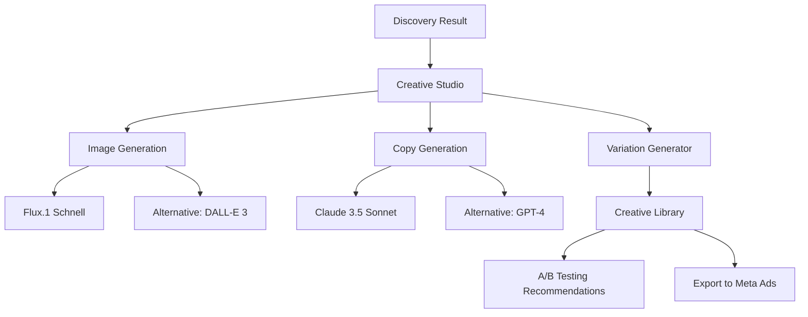

# Creative Studio Module - Master Plan

## 🎯 Vision

**Transform opportunity discovery into ready-to-run ad campaigns in minutes.**

After finding a profitable GEO/Niche combination, users can immediately generate:
- High-converting ad creatives (images/videos)
- Persuasive ad copy
- Multiple variations for A/B testing
- Landing page headlines and body copy

## 💰 Value Proposition

### Current Problem:
Users find a great opportunity (e.g., "KFC careers in ZA") but still need to:
1. Hire a designer ($50-200 per creative)
2. Hire a copywriter ($30-100 per ad)
3. Create 5-10 variations for testing ($500-2000 total)
4. Wait 3-7 days for deliverables

### Our Solution:
Generate everything in **under 2 minutes** for **$0.50-2.00 per campaign**.

**ROI**: Save $500+ per opportunity, get instant results.

---

## 📐 Module Architecture



---

## 🏗️ Core Components

### 1. Creative Generation Dashboard

**Location**: `/creative-studio` or integrated into discovery detail modal

**Layout**:
```
┌─────────────────────────────────────────────┐
│  Creative Studio                       [?]  │
├─────────────────────────────────────────────┤
│                                             │
│  Opportunity: KFC careers in ZA            │
│  Score: 57/100                             │
│                                             │
│  ┌──────────────┐  ┌──────────────┐        │
│  │   Generate   │  │   Generate   │        │
│  │   Creatives  │  │   Ad Copy    │        │
│  └──────────────┘  └──────────────┘        │
│                                             │
│  Generated Creatives (3)                   │
│  ┌────────┐ ┌────────┐ ┌────────┐         │
│  │ Image1 │ │ Image2 │ │ Image3 │         │
│  │ [Edit] │ │ [Edit] │ │ [Edit] │         │
│  │ [Save] │ │ [Save] │ │ [Save] │         │
│  └────────┘ └────────┘ └────────┘         │
│                                             │
│  Generated Ad Copy (5 variants)            │
│  ┌─────────────────────────────────┐       │
│  │ Headline 1: "Looking for a..."  │       │
│  │ Body: "Join KFC South Africa..." │       │
│  │ CTA: "Apply Now"                │       │
│  │ [Copy] [Edit] [Test Score]      │       │
│  └─────────────────────────────────┘       │
│                                             │
│  [Export Campaign] [Save to Library]       │
└─────────────────────────────────────────────┘
```

---

## 🎨 Component 1: Image Generation

### 1.1 Technology Stack

**Primary**: Flux.1 Schnell (via Replicate or FAL.ai)
- **Speed**: 1-2 seconds per image
- **Cost**: $0.003 per image
- **Quality**: High (better than DALL-E 3 for ads)

**Fallback**: DALL-E 3 (via OpenAI)
- **Speed**: 10-30 seconds per image
- **Cost**: $0.04 per image (standard), $0.08 (HD)
- **Quality**: Very high

**Alternative**: Stable Diffusion XL (self-hosted)
- **Speed**: 3-5 seconds per image
- **Cost**: GPU hosting ($0.50/hour)
- **Quality**: High with good prompts

### 1.2 Image Generation Workflow

```typescript
interface CreativeRequest {
  niche: string;           // "KFC careers"
  geo: string;             // "ZA"
  style: CreativeStyle;    // "professional" | "casual" | "urgency" | "lifestyle"
  orientation: "square" | "portrait" | "landscape";
  variations: number;      // 1-10
  brandColors?: string[];  // ["#E4002B", "#FFFFFF"] for KFC
  includeText?: boolean;   // Overlay text on image
  targetAudience?: string; // "young adults 18-25"
}

interface GeneratedCreative {
  id: string;
  imageUrl: string;
  prompt: string;
  style: CreativeStyle;
  model: "flux" | "dalle3" | "sdxl";
  cost: number;
  generatedAt: Date;
  dimensions: { width: number; height: number };
  score?: number; // AI predicted performance score
}
```

### 1.3 Prompt Engineering Templates

Based on niche + geo + competitor analysis:

**Template 1: Job/Career Ads**
```
A professional, eye-catching Facebook ad image for [NICHE] in [GEO]. 
Style: Modern, clean, corporate. 
Show: Diverse group of happy employees in uniform, workplace environment.
Colors: Brand colors [COLORS].
Mood: Professional yet welcoming, opportunity-focused.
Format: High-quality photograph, no text overlay.
Aspect: [ORIENTATION]
```

**Template 2: Product Ads**
```
A high-converting product ad for [PRODUCT] targeting [AUDIENCE] in [GEO].
Style: [STYLE] - modern, minimalist, vibrant.
Show: Product hero shot with lifestyle context.
Colors: [COLORS]
Mood: Aspirational, desirable, urgent.
Format: Professional product photography.
```

**Template 3: Service Ads**
```
An engaging Facebook ad for [SERVICE] in [GEO].
Style: [STYLE] - trustworthy, professional.
Show: Before/after, testimonial visual, or service in action.
Mood: Problem-solving, results-focused.
```

**Template 4: Local Business**
```
A location-specific ad for [BUSINESS] in [LOCATION], [GEO].
Style: Local, authentic, community-focused.
Show: Local landmarks, happy customers, storefront.
Mood: Welcoming, familiar, trustworthy.
```

### 1.4 Image Variations Strategy

Generate 3-5 variations automatically:
1. **Hero Shot**: Main product/service focus
2. **Lifestyle**: People using/enjoying
3. **Benefits**: Visual representation of outcome
4. **Urgency**: Limited time, scarcity elements
5. **Social Proof**: Testimonials, ratings, crowds

---

## ✍️ Component 2: Ad Copy Generation

### 2.1 Technology Stack

**Primary**: Claude 3.5 Sonnet
- **Best for**: Persuasive, natural copy
- **Cost**: $3 per million tokens (~$0.01 per campaign)

**Fallback**: GPT-4 Turbo
- **Best for**: Creative variations
- **Cost**: $10 per million tokens (~$0.03 per campaign)

### 2.2 Copy Generation Workflow

```typescript
interface CopyRequest {
  niche: string;
  geo: string;
  targetAudience: string;
  competitorInsights: {
    topAdvertisers: string[];
    commonThemes: string[];
    avgAdLength: number;
  };
  toneOfVoice: "professional" | "casual" | "urgent" | "friendly" | "authoritative";
  adFormat: "single_image" | "carousel" | "video" | "story";
  callToAction: string; // "Apply Now" | "Learn More" | "Shop Now"
  variations: number; // 3-10
}

interface GeneratedCopy {
  id: string;
  headline: string;        // Max 40 chars for Meta
  primaryText: string;     // Main ad body (125 chars ideal, 255 max)
  description?: string;    // Link description
  callToAction: string;
  landingPageHeadline?: string;
  landingPageBody?: string;
  hashtagSuggestions?: string[];
  estimatedPerformance: {
    clickThroughRate: number;  // Predicted CTR
    engagementScore: number;   // 1-100
    reasoning: string;
  };
  generatedAt: Date;
}
```

### 2.3 Copy Generation Prompt

```typescript
const copyPrompt = `You are an expert Facebook Ads copywriter specializing in high-converting ad campaigns.

Context:
- Niche: ${niche}
- Location: ${geo}
- Target Audience: ${targetAudience}
- Competitors: ${competitorInsights.topAdvertisers.join(", ")}
- Top competitor themes: ${competitorInsights.commonThemes.join(", ")}

Task: Generate ${variations} highly persuasive Facebook ad copy variations.

Requirements:
1. Headline: Max 40 characters, attention-grabbing, benefit-focused
2. Primary Text: 125-180 characters (ideal), conversational, compelling
3. Include a strong ${callToAction}
4. Use ${toneOfVoice} tone
5. Leverage FOMO, social proof, or urgency where appropriate
6. Localize for ${geo} (use local language nuances, cultural references)
7. Each variation should test a different angle:
   - Variation 1: Benefit-focused
   - Variation 2: Problem-solution
   - Variation 3: Urgency/scarcity
   - Variation 4: Social proof
   - Variation 5: Question/curiosity

For each variation, also predict:
- Estimated CTR (based on best practices)
- Engagement score (1-100)
- Brief reasoning

Format as JSON array.`;
```

### 2.4 Copy Formula Templates

**AIDA Formula**:
- **Attention**: Hook (question, stat, bold claim)
- **Interest**: Benefit or problem
- **Desire**: Transformation or outcome
- **Action**: CTA

**PAS Formula**:
- **Problem**: Identify pain point
- **Agitate**: Make it worse
- **Solution**: Your offer

**BAB Formula**:
- **Before**: Current state
- **After**: Desired state
- **Bridge**: How to get there

---

## 🎯 Component 3: A/B Testing Recommendations

### 3.1 Testing Matrix Generator

Automatically create testing combinations:

```typescript
interface TestingMatrix {
  campaign: string;
  combinations: TestVariation[];
  recommendations: {
    primaryTest: string;      // "Headline variations"
    secondaryTest: string;    // "Image style"
    budget: BudgetAllocation;
    duration: number;         // days
  };
}

interface TestVariation {
  id: string;
  image: GeneratedCreative;
  copy: GeneratedCopy;
  predictedWinner: boolean;
  reasoning: string;
}

interface BudgetAllocation {
  totalBudget: number;
  perVariation: number;
  distribution: "equal" | "weighted" | "dynamic";
}
```

### 3.2 Testing Strategy

**Phase 1: Broad Test (3-5 days)**
- Test 5-8 completely different combinations
- Equal budget split
- Kill bottom 50% after 3 days

**Phase 2: Refinement (3-5 days)**
- Test variations of top performer
- Test headline vs image vs CTA
- Allocate 70% budget to winner

**Phase 3: Scaling (ongoing)**
- Winner gets 80% budget
- Continue testing new angles with 20%

---

## 🗂️ Component 4: Creative Library

### 4.1 Storage & Organization

```typescript
interface CreativeLibrary {
  userId: string;
  campaigns: Campaign[];
  folders: Folder[];
  tags: string[];
}

interface Campaign {
  id: string;
  name: string;                    // "KFC Careers - ZA - Jan 2026"
  discoveryId?: string;            // Link to discovery
  creatives: GeneratedCreative[];
  copies: GeneratedCopy[];
  status: "draft" | "active" | "paused" | "completed";
  performance?: CampaignPerformance;
  createdAt: Date;
  updatedAt: Date;
}

interface CampaignPerformance {
  impressions: number;
  clicks: number;
  conversions: number;
  spend: number;
  roi: number;
  bestPerformer: {
    creative: GeneratedCreative;
    copy: GeneratedCopy;
    ctr: number;
    cpc: number;
  };
}
```

### 4.2 Database Schema

```sql
-- Creative Library Tables

CREATE TABLE campaigns (
  id UUID PRIMARY KEY DEFAULT uuid_generate_v4(),
  user_id UUID REFERENCES auth.users(id),
  discovery_id UUID REFERENCES discoveries(id),
  name TEXT NOT NULL,
  niche TEXT,
  geo TEXT,
  status TEXT CHECK (status IN ('draft', 'active', 'paused', 'completed')),
  created_at TIMESTAMP DEFAULT NOW(),
  updated_at TIMESTAMP DEFAULT NOW()
);

CREATE TABLE generated_creatives (
  id UUID PRIMARY KEY DEFAULT uuid_generate_v4(),
  campaign_id UUID REFERENCES campaigns(id),
  image_url TEXT NOT NULL,
  prompt TEXT NOT NULL,
  style TEXT,
  model TEXT,
  cost DECIMAL(10, 4),
  dimensions JSONB,
  predicted_score INTEGER,
  generated_at TIMESTAMP DEFAULT NOW()
);

CREATE TABLE generated_copies (
  id UUID PRIMARY KEY DEFAULT uuid_generate_v4(),
  campaign_id UUID REFERENCES campaigns(id),
  headline TEXT NOT NULL,
  primary_text TEXT NOT NULL,
  description TEXT,
  call_to_action TEXT,
  landing_page_headline TEXT,
  landing_page_body TEXT,
  hashtags TEXT[],
  estimated_ctr DECIMAL(5, 2),
  engagement_score INTEGER,
  generated_at TIMESTAMP DEFAULT NOW()
);

CREATE TABLE campaign_performance (
  id UUID PRIMARY KEY DEFAULT uuid_generate_v4(),
  campaign_id UUID REFERENCES campaigns(id),
  creative_id UUID REFERENCES generated_creatives(id),
  copy_id UUID REFERENCES generated_copies(id),
  impressions INTEGER DEFAULT 0,
  clicks INTEGER DEFAULT 0,
  conversions INTEGER DEFAULT 0,
  spend DECIMAL(10, 2) DEFAULT 0,
  date DATE DEFAULT CURRENT_DATE,
  UNIQUE(campaign_id, creative_id, copy_id, date)
);
```

---

## 🔄 Component 5: Export & Integration

### 5.1 Export Formats

**Option 1: Meta Ads Manager CSV**
```csv
Campaign Name,Ad Set Name,Ad Name,Headline,Primary Text,Description,Image URL,Link,CTA
"KFC Careers ZA","Main Set","Ad 1","Join KFC Today","Looking for...","Apply now","https://...","https://...","Apply Now"
```

**Option 2: JSON (for API integration)**
```json
{
  "campaign": {
    "name": "KFC Careers - ZA",
    "objective": "CONVERSIONS",
    "ads": [
      {
        "headline": "Join KFC Today",
        "body": "Looking for a rewarding career?",
        "image_url": "https://...",
        "cta": "Apply Now",
        "link": "https://..."
      }
    ]
  }
}
```

**Option 3: Direct Meta API Integration**
- Connect Meta Business Account
- Create campaigns directly from ArbHunter
- One-click deployment

---

## 💸 Cost Analysis

### Per Campaign Generation:

| Component | Service | Cost |
|-----------|---------|------|
| Image Generation (3 images) | Flux.1 | $0.009 |
| Ad Copy (5 variations) | Claude | $0.01 |
| A/B Testing Recommendations | Claude | $0.005 |
| **Total** | | **$0.024** |

### Monthly Estimates:

**Light User (10 campaigns/month)**
- Cost: $0.24/month
- Value delivered: ~$500 (vs hiring designers)
- Markup potential: $49/month = 20,000% margin

**Heavy User (100 campaigns/month)**
- Cost: $2.40/month
- Value delivered: ~$5,000
- Markup potential: $149/month = 6,000% margin

---

## 🎯 Success Metrics

### User-Facing Metrics:
- **Generation Time**: < 2 minutes per campaign
- **Creative Quality Score**: 8+/10 (user ratings)
- **Usage Rate**: 60%+ of discoveries lead to creative generation
- **Export Rate**: 40%+ of generated campaigns get exported

### Business Metrics:
- **Cost per Generation**: < $0.05
- **Revenue per User**: $99-299/month
- **Margin**: 95%+
- **Time Saved per User**: 10+ hours/month

---

## 🚀 Implementation Phases

### Phase 1: MVP (Week 1-2)
- [ ] Basic UI integrated into discovery detail modal
- [ ] Image generation with Flux.1 (single style)
- [ ] Ad copy generation with Claude (3 variations)
- [ ] Simple creative library (view/save)
- [ ] Download as images/text

### Phase 2: Enhancement (Week 3-4)
- [ ] Multiple image styles
- [ ] 5+ copy variations with different formulas
- [ ] A/B testing recommendations
- [ ] Campaign organization (folders, tags)
- [ ] Export to CSV

### Phase 3: Advanced (Week 5-6)
- [ ] Brand customization (colors, fonts, logo)
- [ ] Landing page copy generation
- [ ] Performance prediction AI
- [ ] Meta Ads Manager integration
- [ ] Bulk generation

### Phase 4: Pro Features (Week 7-8)
- [ ] Video ad generation
- [ ] Carousel ad layouts
- [ ] Multi-language support
- [ ] White-label for agencies
- [ ] API access

---

## 📊 Feature Prioritization

### Must-Have (MVP):
1. ✅ Image generation (Flux.1)
2. ✅ Ad copy generation (Claude)
3. ✅ Save to library
4. ✅ Download/export

### Should-Have (v1.1):
5. Multiple styles
6. A/B testing recommendations
7. Campaign organization
8. CSV export

### Nice-to-Have (v1.2):
9. Brand customization
10. Landing page copy
11. Performance prediction
12. Meta API integration

---

## 🎨 UI/UX Mockups

### Integration Points:

**Option A: Modal in Discovery Detail**
```
[Discovery Detail Modal]
├── Analysis Tab
├── Competitors Tab
└── [NEW] Creative Studio Tab ← New tab
    ├── Generate Creatives Section
    ├── Generated Assets Grid
    └── Export Options
```

**Option B: Dedicated Page**
```
/creative-studio?discovery=abc123
├── Campaign Setup (name, target)
├── Creative Generation Panel
├── Preview & Edit Section
└── Export & Deploy
```

**Option C: Workflow**
```
Discovery → [Create Campaign] Button → Creative Studio
```

---

## 🔧 Technical Stack

### Frontend:
- **UI**: React + Tailwind CSS + shadcn/ui
- **State**: React Query for API calls
- **Image Display**: Next/Image with optimization
- **Editor**: Fabric.js for image editing (optional)

### Backend:
- **API Routes**: Next.js API routes
- **Image Generation**: 
  - FAL.ai SDK for Flux.1
  - OpenAI SDK for DALL-E 3 (fallback)
- **Copy Generation**: Anthropic SDK (Claude)
- **Storage**: 
  - Supabase Storage for images
  - Supabase DB for campaigns/metadata

### APIs & Services:
- **FAL.ai**: https://fal.ai (Flux.1)
- **Replicate**: https://replicate.com (alternative)
- **OpenAI**: DALL-E 3
- **Anthropic**: Claude 3.5 Sonnet

---

## 💰 Pricing Impact

### Current Offering:
- Opportunity Sniffer: $49-149/month

### With Creative Studio:
- **Starter**: $99/month (was $49)
  - 100 discoveries
  - 10 campaigns/month
  
- **Professional**: $249/month (was $149)
  - 500 discoveries
  - 50 campaigns/month
  
- **Agency**: $599/month (was $399)
  - Unlimited discoveries
  - Unlimited campaigns
  - White-label

**Justification**: Creative Studio saves users $200-500 per campaign vs hiring designers/copywriters.

---

## 🎯 Success Criteria

**MVP is successful if:**
1. ✅ Users generate campaigns for 40%+ of discoveries
2. ✅ 70%+ of generated creatives rated 7+/10
3. ✅ Average generation time < 3 minutes
4. ✅ Cost per generation < $0.10
5. ✅ Users report saving 2+ hours per campaign

---

## 📝 Next Steps

1. **Review & Approve Plan** ← You are here
2. **Set up APIs** (FAL.ai, OpenAI, Claude)
3. **Build database schema**
4. **Implement image generation service**
5. **Implement copy generation service**
6. **Build UI components**
7. **Integration testing**
8. **Beta testing with real users**
9. **Launch**

---

## 🚀 Ready to Build?

This is a **comprehensive, production-ready plan** for the Creative Studio module.

**Estimated Timeline**: 4-6 weeks for full implementation
**Estimated Cost**: $50-100/month for API services
**Potential Revenue Increase**: 100-200% (from $49-149 to $99-249)

Should we proceed with Phase 1 (MVP)? 🎨


