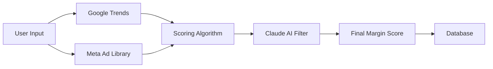

# 🎯 ArbHunter - AI-Powered Ad Arbitrage Platform


**ArbHunter** is a complete SaaS platform for ad arbitrage intelligence and automation. Discover profitable opportunities, analyze competition, and generate high-converting ad creatives—all powered by AI.

## ✨ Platform Capabilities

### 🎯 Opportunity Sniffer (Live)
- **Intelligent Discovery**: Analyzes Google Trends + Meta Ads Library
- **AI-Powered Scoring**: 100-point margin potential score
- **Real-Time Competitor Analysis**: Active ads, advertisers, sample copy
- **Batch Processing**: Run multiple discoveries simultaneously
- **Historical Tracking**: Store and review past discoveries

### 🎨 Creative Studio (Live)
- **AI Image Generation**: Flux.1 Schnell ($0.003/image, ~3-5 seconds)
- **AI Copy Generation**: OpenAI/Gemini/Claude ($0.01/copy, ~2-3 seconds)
- **8 Creative Styles**: Professional, Casual, Lifestyle, Urgency, and more
- **Proven Copy Formulas**: AIDA, PAS, BAB auto-selected by niche
- **Creative Library**: Manage all assets in one place
- **Seamless Workflow**: Discovery → Competitor Analysis → Creative Generation

### 💰 Total Cost Per Campaign: $0.065
- 5 AI-generated images: $0.015
- 5 AI-generated copy variations: $0.05
- **Output**: 25 possible ad combinations (5 images × 5 copies)

## 🚀 Quick Start

### 1. Installation

```bash
# Navigate to project
cd /Users/billkamanzi/Documents/ArbHunter

# Install dependencies
npm install

# Copy environment template
cp env.example .env.local
```

### 2. Database Setup

```bash
# In Supabase Dashboard (https://supabase.com/dashboard):
# 1. Create a new project
# 2. Go to SQL Editor
# 3. Run: supabase/migrations/001_initial.sql
# 4. Run: supabase/migrations/002_creative_studio.sql
# 5. Copy your project URL and anon key to .env.local
```

### 3. API Keys (Optional - System works with mock data)

```bash
# Add to .env.local:

# Required for Creative Studio images
FAL_API_KEY=your_fal_key  # Get at https://fal.ai/

# At least one required for AI copy (will fallback)
OPENAI_API_KEY=sk-proj-...
GEMINI_API_KEY=...
ANTHROPIC_API_KEY=sk-ant-...

# Optional for live competitor data
APIFY_API_KEY=apify_api_...
GOOGLE_TRENDS_API_KEY=...
```

### 4. Run

```bash
npm run dev
# Open http://localhost:3000
```

## 🎯 Quick Demo (No Setup Required!)

The platform works out of the box with **intelligent mock data**:

1. Start the dev server: `npm run dev`
2. Select a GEO (e.g., South Africa - ZA)
3. Enter a niche (e.g., "SASSA vacancies")
4. Click "Run Discovery"
5. View your margin score and analysis

## 🔑 API Configuration (Optional)

To enable real data, configure these services:

### Supabase (Database)

1. Create a project at [supabase.com](https://supabase.com)
2. Run the SQL schema: Copy contents of `supabase-schema.sql` into your Supabase SQL Editor
3. Add credentials to `.env.local`:
```env
NEXT_PUBLIC_SUPABASE_URL=your_project_url
NEXT_PUBLIC_SUPABASE_ANON_KEY=your_anon_key
```

### Claude AI (Opportunity Analysis)

1. Get API key from [anthropic.com](https://anthropic.com)
2. Add to `.env.local`:
```env
ANTHROPIC_API_KEY=sk-ant-...
```

### Google Trends (Trend Data)

1. Sign up for NoCodeAPI at [nocodeapi.com](https://nocodeapi.com)
2. Connect your Google Trends endpoint
3. Add to `.env.local`:
```env
GOOGLE_TRENDS_API_KEY=your_key
```

### Apify (Meta Ad Library)

1. Create account at [apify.com](https://apify.com)
2. Get API token from account settings
3. Add to `.env.local`:
```env
APIFY_API_KEY=apify_api_...
```

**Note**: The system automatically falls back to mock data if any API key is missing.

## 📊 How It Works



1. **Trend Analysis**: Fetches search volume and growth rate data
2. **Competition Check**: Analyzes advertiser density and CPC
3. **Algorithmic Scoring**: Calculates preliminary score (0-100)
4. **AI Validation**: Claude adjusts score based on market insights
5. **Persistence**: Saves results to Supabase or in-memory storage

## 🏗️ Project Structure

```
ArbHunter/
├── app/
│   ├── page.tsx              # Main dashboard
│   ├── layout.tsx            # Root layout with Toaster
│   └── api/
│       ├── discover/         # Discovery endpoint
│       └── discoveries/      # Fetch all discoveries
├── components/
│   ├── ui/                   # shadcn components
│   ├── DiscoveryForm.tsx     # GEO/Niche input form
│   ├── ResultsTable.tsx      # Discovery results display
│   └── ScoreIndicator.tsx    # Visual score display
├── lib/
│   ├── scoring.ts            # Margin calculation logic
│   ├── supabase.ts           # Database client
│   └── storage.ts            # In-memory fallback
├── services/
│   ├── trends.service.ts     # Google Trends integration
│   ├── meta.service.ts       # Meta Ad Library integration
│   └── claude.service.ts     # AI analysis
├── types/
│   └── index.ts              # TypeScript definitions
└── supabase-schema.sql       # Database schema
```

## 🎨 Tech Stack

- **Frontend**: Next.js 14 (App Router), React, TypeScript
- **Styling**: Tailwind CSS, shadcn/ui
- **Database**: Supabase (PostgreSQL)
- **AI**: Claude 3.5 Sonnet (Anthropic)
- **APIs**: Google Trends (NoCodeAPI), Meta Ad Library (Apify)
- **Deployment**: Vercel-ready

## 📈 Scoring Algorithm

The Margin Potential Score (1-100) is calculated from three factors:

### 1. Trend Velocity (0-40 points)
- Search volume magnitude
- Growth rate percentage
- Peak interest momentum

### 2. Competition Density (0-30 points)
- Number of active advertisers (inverse)
- Competition level (low/medium/high)
- Market saturation percentage

### 3. CPC vs RPM Spread (0-30 points)
- Profit margin per click
- GEO-specific RPM baselines
- Estimated arbitrage profitability

**Interpretation**:
- **80-100**: Excellent - Launch immediately
- **60-79**: Good - Solid opportunity
- **40-59**: Fair - Test with caution
- **20-39**: Poor - High risk
- **1-19**: Very Poor - Avoid

## 🧪 Testing

Test the system with these proven niches:

| GEO | Niche | Expected Score |
|-----|-------|----------------|
| ZA (South Africa) | SASSA vacancies | 75-85 |
| ZA (South Africa) | TymeBank credit limit | 70-80 |
| PH (Philippines) | Government jobs | 65-75 |
| NG (Nigeria) | Online loans | 70-80 |

## 📚 Complete Documentation

### 📖 Quick Guides
- **🚀 Quick Start Creative Studio**: `QUICK_START_CREATIVE_STUDIO.md` - 10-minute setup
- **🔄 Complete Workflow**: `WORKFLOW_GUIDE.md` - Platform workflow with diagrams
- **🎯 What's Next**: `WHATS_NEXT.md` - Roadmap & recommendations

### 📘 Module Documentation
- **Opportunity Sniffer**: `OPPORTUNITY_SNIFFER_COMPLETE.md`
- **Creative Studio**: `CREATIVE_STUDIO_COMPLETE.md`
- **Summary**: `CREATIVE_STUDIO_SUMMARY.md`

### 🔧 Technical
- **Database**: `supabase/migrations/`
- **API**: `app/api/`
- **Services**: `services/`

## 🚧 Development Status

### ✅ Phase 1: Opportunity Sniffer (COMPLETE)
- [x] Single & batch discovery
- [x] Google Trends integration
- [x] Meta Ads Library scraping (Apify + Playwright)
- [x] AI opportunity analysis (multi-provider)
- [x] Margin scoring algorithm
- [x] Real-time competitor analysis
- [x] Related keywords extraction
- [x] Historical discovery tracking
- [x] Complete UI with modal details

### ✅ Phase 2: Creative Studio (COMPLETE)
- [x] Campaign management
- [x] AI image generation (Flux.1 Schnell)
- [x] AI copy generation (OpenAI/Gemini/Claude)
- [x] 8 creative styles + 3 orientations
- [x] Proven copy formulas (AIDA, PAS, BAB)
- [x] Creative library
- [x] Deep linking from discoveries
- [x] Real-time cost estimation
- [x] Database persistence

### 🔜 Phase 3: Authentication & Billing (NEXT)
- [ ] User signup/login (Supabase Auth)
- [ ] Subscription tiers (Free, Starter, Pro, Agency)
- [ ] Payment processing (Stripe)
- [ ] Usage limits per tier
- [ ] Billing portal
- [ ] Usage analytics

### 🔮 Phase 4: Article Factory (FUTURE)
- [ ] AI article generation
- [ ] SEO optimization
- [ ] WordPress integration
- [ ] Medium integration
- [ ] Content analytics

### 🔮 Phase 5: Performance Dashboard (FUTURE)
- [ ] Ad platform integration (Meta, Google)
- [ ] ROI tracking
- [ ] Performance analytics
- [ ] AI recommendations

## 📝 License

Proprietary - All rights reserved

## 🤝 Support

For issues or questions, please contact the development team.

---

Built with ❤️ for ad arbitrage professionals
# ArbHunter
